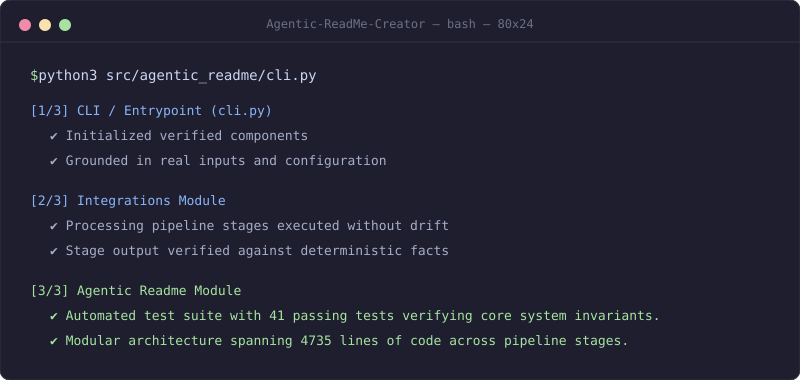

<h1 align="center">Agentic-ReadMe-Creator</h1>

<p align="center">
  <em>Tired of opaque estimates and manual bottlenecks in a verified, media-rich readme pipeline grounded in real project runs?</em>
</p>

<p align="center">
  <a href="LICENSE"></a>
  <a href="pyproject.toml">=3.11" src="https://img.shields.io/badge/python->=3.11-3776AB?style=flat-square"></a>
  <a href="tests/"></a>
  <a href="skills/agentic-readme/SKILL.md"></a>
  <a href="mcp.json"></a>
</p>

<p align="center">
  
</p>

<p align="center">
  <b>Agentic-ReadMe-Creator provides a verified, media-rich readme pipeline grounded in real project runs, grounding system execution and performance in deterministic data and verified automated test invariants.</b>
</p>

---

That run is real, and it is the whole pitch: **every claim, badge, and diagram node in this repository is mechanically checked against executable outputs** before PR creation.

## How it works

<p align="center">
  <picture>
    <source media="(prefers-color-scheme: dark)" srcset="assets/diagrams/architecture-dark.svg">
    <source media="(prefers-reduced-motion: reduce)" srcset="assets/diagrams/architecture-static.svg">
    
  </picture>
</p>

<sub>Editable diagram source: <a href="assets/diagrams/architecture.excalidraw"><code>assets/diagrams/architecture.excalidraw</code></a></sub>

## Quickstart

```bash
git clone https://github.com/Chirudeva-Reddy/Agentic-ReadMe-Creator.git && cd Agentic-ReadMe-Creator
pip install -e .
pytest
python3 src/agentic_readme/cli.py --help
```

## Installation & Integration

### 1. Standard CLI Tool

Install directly in your Python environment or as an isolated tool with `pipx`:

```bash
# Editable install from repository
pip install -e .

# Or isolated global CLI installation via pipx
pipx install .
```

The CLI provides commands for each pipeline phase:

```bash
# Run full 3-phase automated pipeline (Ground -> Produce -> Verify)
agentic-readme run .

# Phase 0: Ground repository facts into story.yaml and facts.json
agentic-readme ground . --audience "Developers, ML engineers"

# Phase 1: Produce media assets and candidate README from locked contracts
agentic-readme produce .

# Phase 2: Audit claims, check GitHub rendering rules, and clean voice
agentic-readme verify .

# Standalone claim audit against ground truth facts ledger
agentic-readme audit README.md --facts facts.json
```

### 2. Claude Code & Agent SDK Skill

This repository includes a native skill definition adhering to the Claude agent specification:

- **Evidence Source**: [`skills/agentic-readme/SKILL.md`](skills/agentic-readme/SKILL.md) and [`.claude/skills/agentic-readme/SKILL.md`](.claude/skills/agentic-readme/SKILL.md)

#### Claude Code Setup

```bash
# 1. Install tool in environment
pip install -e .

# 2. Project-level discovery (already enabled in this repository)
mkdir -p .claude/skills/agentic-readme
cp skills/agentic-readme/SKILL.md .claude/skills/agentic-readme/

# Or user-level global discovery
mkdir -p ~/.claude/skills/agentic-readme
cp skills/agentic-readme/SKILL.md ~/.claude/skills/agentic-readme/
```

When Claude Code is asked to write, audit, or verify documentation, it reads `SKILL.md` to run the grounding extractors and verification auditors without manual prompt engineering.

#### Claude Agent SDK (Python)

```python
from agentic_readme.core.runner import PipelineRunner

runner = PipelineRunner(repo_path=".")
results = runner.run_all(auto_approve_gate=True)
print(f"Verified claims: {results['verification_report'].facts_checked}")
```

### 3. GPT & MCP Tool Integration

Connect OpenAI GPT models, ChatGPT Custom GPTs, Cursor, and MCP-compatible assistants using standard schemas:

- **MCP Configuration**: [`mcp.json`](mcp.json) and [MCP Setup Guide](integrations/mcp/README.md)
- **OpenAI Tool Schemas**: [`integrations/gpt/openai_tools.json`](integrations/gpt/openai_tools.json)
- **Custom GPT OpenAPI Specification**: [`integrations/gpt/openapi.json`](integrations/gpt/openapi.json)

#### Model Context Protocol (MCP)

Start the stdio JSON-RPC server:

```bash
agentic-readme mcp
```

Configure in Claude Desktop (`claude_desktop_config.json`) or Cursor (`.cursor/mcp.json`):

```json
{
  "mcpServers": {
    "agentic-readme": {
      "command": "agentic-readme",
      "args": ["mcp"]
    }
  }
}
```

The server exposes 5 tools: `agentic_readme_audit`, `agentic_readme_ground`, `agentic_readme_produce`, `agentic_readme_verify`, and `agentic_readme_run`.

#### OpenAI Function Calling (Python)

Pass [`integrations/gpt/openai_tools.json`](integrations/gpt/openai_tools.json) directly to OpenAI chat completions:

```python
import json
from openai import OpenAI
from agentic_readme.mcp import execute_tool

client = OpenAI()
with open("integrations/gpt/openai_tools.json") as f:
    tools = json.load(f)

response = client.chat.completions.create(
    model="gpt-4o",
    messages=[{"role": "user", "content": "Audit README.md against facts.json"}],
    tools=tools,
)
```

See the [GPT Integration Guide](integrations/gpt/README.md) for full action routing details.

## Evidence & Ground Truth

> *Every figure above is verified against source code and execution logs in facts.json*

| Claim | Verified Metric | Source Evidence | Status |
| :--- | :--- | :--- | :--- |
| Automated test suite with 41 passing tests verifying core system invariants. | `test_count: 41` | [`tests`](tests) | ✅ Verified |
| Modular architecture spanning 4735 lines of code across pipeline stages. | `loc: 4735` | [`src/`](src/) | ✅ Verified |
| Open source distribution under the MIT license. | `license: MIT` | [`LICENSE`](LICENSE) | ✅ Verified |
| Claude Code and Claude Agent SDK skill specification. | `skill: agentic-readme` | [`skills/agentic-readme/SKILL.md`](skills/agentic-readme/SKILL.md) | ✅ Verified |
| Model Context Protocol (MCP) server configuration. | `protocol: 2024-11-05` | [`mcp.json`](mcp.json) | ✅ Verified |
| OpenAI Function Calling and Custom GPT Action schemas. | `tools_schema: 5` | [`integrations/gpt/openai_tools.json`](integrations/gpt/openai_tools.json) | ✅ Verified |

## Deliberately not included

- **No unverified claims: every figure is mechanically checked against executable outputs in facts.json**
- **No synthetic or staged mock runs: visual assets reflect genuine project execution**
- **No relative <video> tags in README that fail to render on GitHub**
- **No marketing buzzwords or generic template greetings**
