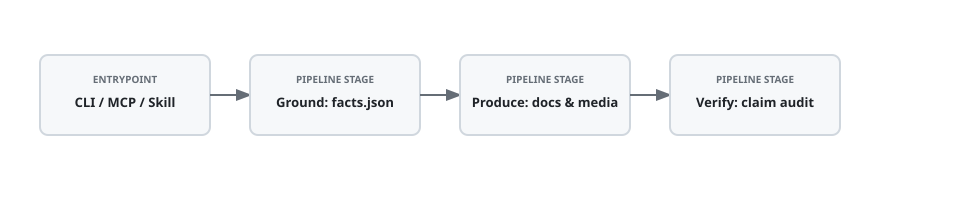

<h1 align="center">Agentic-ReadMe-Creator</h1>

<p align="center">
  <em>Writes your README from your code, then fails the build if the two ever disagree.</em>
</p>

<p align="center">
  <a href="LICENSE"></a>
  <a href="pyproject.toml">=3.11" src="https://img.shields.io/badge/python->=3.11-3776AB?style=flat-square"></a>
  <a href="tests/"></a>
  <a href="skills/agentic-readme/SKILL.md"></a>
  <a href="integrations/mcp/mcp.json"></a>
</p>

<p align="center">
  <a href="assets/video/launch-video.mp4">
    <picture>
      <source media="(prefers-reduced-motion: reduce)" srcset="assets/video/launch-poster.jpg">
      
    </picture>
  </a>
  <br>
  <sub>20 seconds, no sound needed. <a href="assets/video/launch-video.mp4">MP4 with soundtrack</a> · <a href="docs/LAUNCH_VIDEO.md">how it was made</a></sub>
  <br><br>
  <a href="https://chirudeva-reddy.github.io/Agentic-ReadMe-Creator/"><b>Website and case study →</b></a> a bare repo turned into a verified README with a launch video, step by step
</p>

**What it is:** a command-line tool that reads a code project, records what's actually true about it (how many tests pass, the license, the Python version, what the entrypoints are), and writes a README, diagrams, and a launch-video storyboard from those facts. It then audits the README. If a badge or number doesn't match the code, it exits with an error, so your CI can block the pull request.

**Who it's for:** anyone publishing a repository who wants the first page to be both clear and true.

## Start here

| You are a... | Read this | Time |
| :--- | :--- | :--- |
| **Recruiter or reviewer** | The video above, the [case study](https://chirudeva-reddy.github.io/Agentic-ReadMe-Creator/#case-study), then [What this project demonstrates](#what-this-project-demonstrates) | 2 min |
| **Student or first-time visitor** | [Try it in 60 seconds](#quickstart-try-it-in-60-seconds), then the [examples](examples/) | 5 min |
| **Non-technical user** | The [step-by-step install guide](docs/INSTALL.md#track-a-never-used-a-terminal): copy and paste, no Python setup needed | 10 min |
| **Developer** | [Install](#install), then [Architecture](docs/ARCHITECTURE.md) | 5 min |
| **AI assistant user** (Claude, Cursor, ChatGPT) | [Use it from an assistant](#use-it-from-an-ai-assistant) | 3 min |

## Quickstart: try it in 60 seconds

No install: open this repo in [GitHub Codespaces](https://codespaces.new/Chirudeva-Reddy/Agentic-ReadMe-Creator) and paste into the terminal:

```bash
pip install -e . && agentic-readme run examples/tip-splitter
```

It reads the sample project, counts its tests, writes `examples/tip-splitter/README.md`, and verifies it. The run ends with `0 fatal errors`.

Then make that README lie: change its test badge from three to forty and run `agentic-readme audit`. It exits `1` with a fatal "Test count badge drift" finding, which is exactly what a CI check needs. The [3-step walkthrough](examples/README.md#watch-it-catch-a-lie) shows the real output.

## How it works

<p align="center">
  <picture>
    <source media="(prefers-color-scheme: dark)" srcset="assets/diagrams/architecture-dark.svg">
    <source media="(prefers-reduced-motion: reduce)" srcset="assets/diagrams/architecture-static.svg">
    
  </picture>
</p>

1. **Ground.** [`src/agentic_readme/ground/`](src/agentic_readme/ground/) inspects the repo, collects its tests, runs its CLI `--help`, and writes two files to `.agentic-readme/`: `facts.json` (every number, with the file it came from) and `story.yaml` (the pitch, claims, and quickstart). **Review and edit `story.yaml` here.** It's the human checkpoint.
2. **Produce.** [`src/agentic_readme/produce/`](src/agentic_readme/produce/) generates the README, Excalidraw diagrams (light, dark, and static SVGs), a [VHS](https://github.com/charmbracelet/vhs) demo script, and a 20-second [/brag](https://github.com/latent-spaces/brag) video storyboard. All of it is built from those two files and nothing else. The CLI doesn't render video: when you use the [Claude Code skill](skills/agentic-readme/SKILL.md), the agent renders the storyboard with `/brag` and `produce` embeds it as the README's hero GIF.
3. **Verify.** [`src/agentic_readme/verify/`](src/agentic_readme/verify/) checks every badge, number, link, and diagram node against `facts.json`, auto-fixes drift it can fix, flags GitHub rendering problems (like `<video>` tags that won't play), and exits `1` on anything fatal.

The diagram above was generated by this tool from this repo's own [`story.yaml`](.agentic-readme/story.yaml). <sub>Editable source: [`architecture.excalidraw`](assets/diagrams/architecture.excalidraw)</sub>

## Examples

Real runs, with the output committed. Nothing was edited by hand.

| Example | Input | Generated README | Result |
| :--- | :--- | :--- | :--- |
| [`tip-splitter`](examples/tip-splitter/) | Python CLI + pytest | [README.md](examples/tip-splitter/README.md) | 23 facts checked, 0 errors |
| [`habit-streak`](examples/habit-streak/) | Node.js + `node --test` | [README.md](examples/habit-streak/README.md) | 18 facts checked, 0 errors |
| [`csv-dedupe`](examples/csv-dedupe/) | Python CLI, with launch video | [README.md](examples/csv-dedupe/README.md) | 23 facts checked, 0 errors ([case study](https://chirudeva-reddy.github.io/Agentic-ReadMe-Creator/#case-study)) |
| this repo | Python package, 48 tests | the page you're reading | see [Evidence](#evidence--ground-truth) |

See [examples/README.md](examples/README.md) for what each generated file is and how to run them.

## Install

**Not a programmer?** Follow the [copy-and-paste guide](docs/INSTALL.md#track-a-never-used-a-terminal). It installs everything, including Python, in two commands.

**Developers** (Python 3.11+):

```bash
pipx install git+https://github.com/Chirudeva-Reddy/Agentic-ReadMe-Creator.git
```

Then, inside any project:

```bash
agentic-readme ground .      # writes .agentic-readme/{facts.json,story.yaml}; review story.yaml
agentic-readme produce .     # writes README.md + assets/  (overwrites README.md!)
agentic-readme verify .      # audits; exits 1 on fatal drift
```

`agentic-readme run .` does all three in one step. `agentic-readme audit README.md --facts .agentic-readme/facts.json` is read-only and works well as a CI gate ([workflow snippet](docs/INSTALL.md#use-it-in-ci)).

To work on the tool itself:

```bash
git clone https://github.com/Chirudeva-Reddy/Agentic-ReadMe-Creator.git && cd Agentic-ReadMe-Creator
pip install -e ".[dev]" && pytest
```

## Use it from an AI assistant

| Assistant | Setup | Details |
| :--- | :--- | :--- |
| **Claude Code** | `/plugin marketplace add Chirudeva-Reddy/Agentic-ReadMe-Creator`, then `/plugin install agentic-readme@agentic-readme`, then ask *"use agentic-readme to write and verify my README"* | [guide](docs/INSTALL.md#claude-code) |
| **Codex CLI / opencode** | Copy [`skills/agentic-readme/`](skills/agentic-readme/) into your project's `.agents/skills/` | [SKILL.md](skills/agentic-readme/SKILL.md) |
| **Claude Desktop / Cursor** | Add `{"command": "agentic-readme", "args": ["mcp"]}` under `mcpServers`. This exposes 5 tools. | [MCP guide](integrations/mcp/README.md) |
| **ChatGPT / OpenAI API** | Function-calling schemas and a Custom GPT OpenAPI spec | [GPT guide](integrations/gpt/README.md) |
| **Python** | `PipelineRunner(repo_path=".").run_all()` | [runner.py](src/agentic_readme/core/runner.py) |

## What this project demonstrates

For reviewers who want the engineering summary:

- **A staged agent pipeline with a human checkpoint.** Grounding writes locked contracts that the producers can only read, and a verifier loop audits the output ([ARCHITECTURE.md](docs/ARCHITECTURE.md)).
- **Verification rather than generation.** A claim auditor cross-checks the README, diagrams, and video storyboard against a facts ledger, with deterministic auto-fixes ([`verify/`](src/agentic_readme/verify/)).
- **Tested.** 48 pytest tests cover grounding, production, auditing, rendering rules, and an end-to-end pipeline run ([`tests/`](tests/)).
- **Packaged three ways.** A Typer CLI, an MCP JSON-RPC server, and a Claude Code skill, plus OpenAI tool schemas ([`integrations/`](integrations/)).
- **Uses its own output.** This README, its diagram, and its badges come from the tool's own run on this repo, and the [launch video](docs/LAUNCH_VIDEO.md) shows real output from the examples.

## Evidence & Ground Truth

> *Every figure on this page is checked against [`facts.json`](.agentic-readme/facts.json), which the tool produced from this repo's source code and test run.*

| Claim | Verified Metric | Source Evidence | Status |
| :--- | :--- | :--- | :--- |
| Automated test suite with 48 passing tests verifying core system invariants. | `test_count: 48` | [`tests`](tests) | ✅ Verified |
| 3800 lines of code in the project source. | `loc: 3800` | [`src/`](src/) | ✅ Verified |
| Open source distribution under the MIT license. | `license: MIT` | [`LICENSE`](LICENSE) | ✅ Verified |
| Claude Code and Claude Agent SDK skill specification. | `skill: agentic-readme` | [`skills/agentic-readme/SKILL.md`](skills/agentic-readme/SKILL.md) | ✅ Verified |
| Model Context Protocol (MCP) server configuration. | `protocol: 2024-11-05` | [`mcp.json`](integrations/mcp/mcp.json) | ✅ Verified |
| OpenAI Function Calling and Custom GPT Action schemas. | `tools_schema: 5` | [`integrations/gpt/openai_tools.json`](integrations/gpt/openai_tools.json) | ✅ Verified |

## Documentation

| Doc | What's in it |
| :--- | :--- |
| [INSTALL.md](docs/INSTALL.md) | Beginner, developer, AI-assistant, and Codespaces setup, plus CI and troubleshooting |
| [examples/](examples/README.md) | Sample runs and the "catch a lie" walkthrough |
| [ARCHITECTURE.md](docs/ARCHITECTURE.md) | The three phases, contracts, and agents |
| [LAUNCH_VIDEO.md](docs/LAUNCH_VIDEO.md) | How the video was made, and the first-20-seconds README method |
| [HOUSE_STYLE.md](docs/HOUSE_STYLE.md) | The README patterns the writer follows |
| [EVALUATION.md](docs/EVALUATION.md) | The benchmark protocol for evaluating output quality |

## What's in this repo

- `src/agentic_readme/` — the package, one folder per phase: `ground/`, `produce/`, `verify/`, plus `core/` (runner, models) and `rubrics/` (style rules)
- `tests/` — the pytest suite
- `skills/agentic-readme/` — the Claude Code skill
- `integrations/` — MCP config (`mcp/mcp.json`) and OpenAI / Custom GPT setup
- `examples/` — sample projects with their generated output committed
- `assets/` — this README's diagrams, demo, and launch video (`assets/video/src/` rebuilds the video)
- `docs/` — the guides above and the website (GitHub Pages deploy root)
- `.agentic-readme/` — this repo's own contracts (`story.yaml`, `facts.json`), which the README above is built and audited from
- `.claude-plugin/` — plugin manifest and marketplace catalog
- `.claude/skills/agentic-readme/` — symlink → `skills/agentic-readme/` (Claude Code discovery)
- `.agents/skills/agentic-readme/` — symlink → `skills/agentic-readme/` (Codex CLI and opencode discovery)

## Contributing

Issues and pull requests are welcome. Run `pip install -e ".[dev]" && pytest` before opening one, and `agentic-readme audit README.md --facts .agentic-readme/facts.json` if you touched this README.

## Deliberately not included

- **No unverified claims.** Every figure is checked against executable outputs in facts.json.
- **No staged runs.** The terminal output in the video and examples comes from real runs.
- **No relative `<video>` tags,** because GitHub doesn't play them. The video is a GIF that links to the MP4.
- **No LLM required.** The pipeline is deterministic Python, and assistants call it as a tool.
