<h1 align="center">tip-splitter</h1>

<p align="center">
  <em>A tiny CLI that splits a restaurant bill fairly, tip included.</em>
</p>

<p align="center">
  <a href="LICENSE"></a>
  <a href="pyproject.toml">=3.9" src="https://img.shields.io/badge/python->=3.9-3776AB?style=flat-square"></a>
  <a href="tests/"></a>
</p>

<p align="center">
  <picture>
    <source media="(prefers-reduced-motion: reduce)" srcset="assets/demo/hero-demo-static.svg">
    
  </picture>
  <br>
  <sub>Illustrated preview of the quickstart, not a screen recording. Record the real run with <code>vhs assets/demo/demo.tape</code>.</sub>
</p>

<p align="center">
  <b>tip-splitter: A tiny CLI that splits a restaurant bill fairly, tip included.</b>
</p>

---

**Every badge, number, and diagram node on this page is checked against [`facts.json`](facts.json)**, which was generated from this project's own code and test run.

## How it works

<p align="center">
  <picture>
    <source media="(prefers-color-scheme: dark)" srcset="assets/diagrams/architecture-dark.svg">
    <source media="(prefers-reduced-motion: reduce)" srcset="assets/diagrams/architecture-static.svg">
    
  </picture>
</p>

<sub>Editable diagram source: <a href="assets/diagrams/architecture.excalidraw"><code>assets/diagrams/architecture.excalidraw</code></a></sub>

## Quickstart

```bash
git clone <repo-url> && cd tip-splitter
pip install -e .
pytest
python3 cli.py
```

## Evidence & Ground Truth

> *Every figure above is verified against source code and execution logs in facts.json*

| Claim | Verified Metric | Source Evidence | Status |
| :--- | :--- | :--- | :--- |
| Automated test suite with 3 passing tests verifying core system invariants. | `test_count: 3` | [`tests`](tests) | ✅ Verified |
| 36 lines of code in the project source. | `loc: 36` | [`.`](.) | ✅ Verified |
| Open source distribution under the MIT license. | `license: MIT` | [`LICENSE`](LICENSE) | ✅ Verified |

## Deliberately not included

- **No unverified claims: every figure is mechanically checked against executable outputs in facts.json**
- **No invented numbers: every badge and metric comes from facts.json**
- **No relative <video> tags in README that fail to render on GitHub**
- **No marketing buzzwords or generic template greetings**
